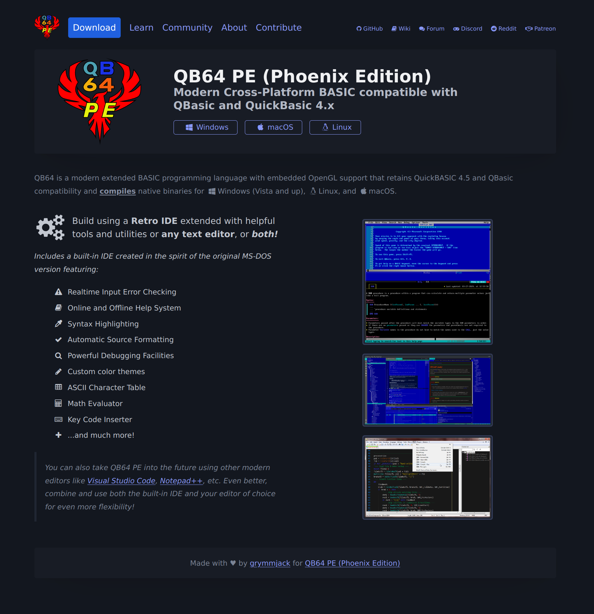

# QB64 PE (Phoenix Edition) Web Site

This repo contains the design and content for the QB64 PE (Phoenix Edition) web site.

We opted to use minimal HTML and CSS only, with no JavaScript and are using:
- [Pico CSS](https://picocss.com/)
- [Flexbox Grid](http://flexboxgrid.com/)
- [Font Awesome v4.x](https://fontawesome.com/v4/icon/home)

More to come, stay tuned.

### Screen shot as of 3/28/24:

Dark theme:

The themes will auto-detect based on user preference thanks to Pico CSS ;)
